# AI Games - Campaign Integration and Runtime Flows

## Purpose

This document defines the MVP boundary between the Games surface, Campaign Center, the hosted game or Customer Portal backend, and the Games database.

The guiding principle is:

> Games controls whether and how a game works. Campaign Center controls which Members are invited to it.

The same game may be distributed through multiple Campaigns. Its Gift, score, win limit, total Gift cap, status, and Member progress remain game-level configuration.

## Product Ownership Boundary

```mermaid
flowchart LR
    subgraph Games[Games surface]
        G1[Game name and branding]
        G2[Score to win]
        G3[Wins allowed per Member]
        G4[Total Gifts available]
        G5[Gift]
        G6[Preview and test]
        G7[Game status]
    end

    subgraph Campaign[Campaign Center]
        C1[Member audience]
        C2[Qualification timing]
        C3[Add eligibility tag]
        C4[Message channel and content]
        C5[Insert game deep link]
        C6[Campaign schedule and status]
    end

    subgraph Managed[Read-only Rules managed by Games]
        R1[Grant Game Gift]
        R2[Remove Game Access]
    end

    Games --> Managed
    Campaign -->|distributes| Games
```

### Source of truth

| Concern | Source of truth |
|---|---|
| Current game configuration | Games database |
| Whether the game is On or Paused | Games database |
| Member wins and accepted result IDs | Games participation table |
| Which Members receive the invitation | Campaign Center |
| Eligibility before game load | Member eligibility tag |
| Gift delivery | Campaign Center Rule reacting to accepted Games event |
| Final access removal | Campaign Center Rule reacting to limit-reached event |

`Member_At_Location_ScoreTable` is the current conceptual name for the participation table. R&D should confirm the production schema and ownership.

## Game State Model

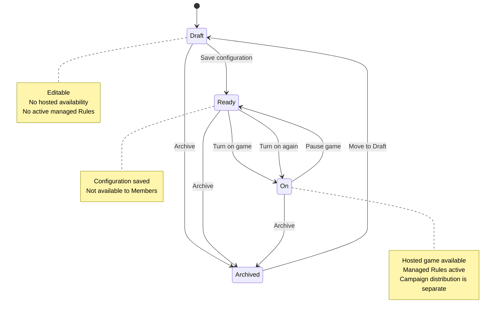

The UI may label a paused game as `Paused`, while the underlying lifecycle returns it to a Ready-like state with its saved configuration and Member progress preserved.

## Merchant Setup Flow

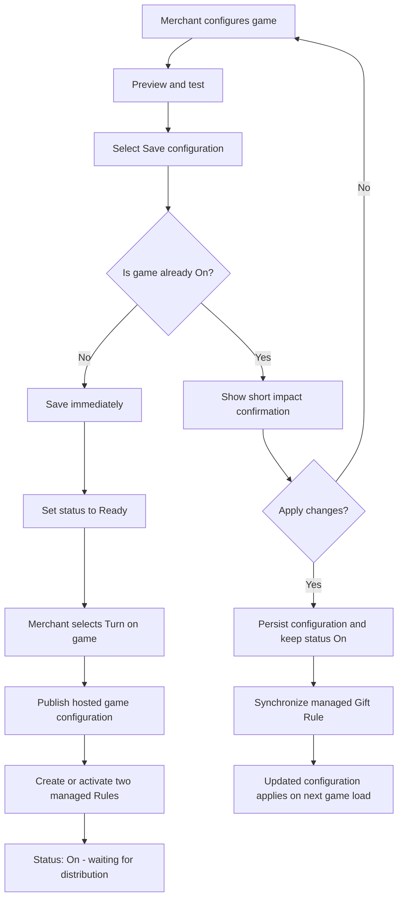

### Save behavior

Draft and Ready games save immediately without a modal. Only an already On game shows a short confirmation:

> The updated configuration will affect all existing and future eligible Members.

Backend behavior remains unchanged: Member progress is preserved, the latest configuration is used on the next game load, and previously delivered Gifts are not changed.

## Campaign Distribution Flow

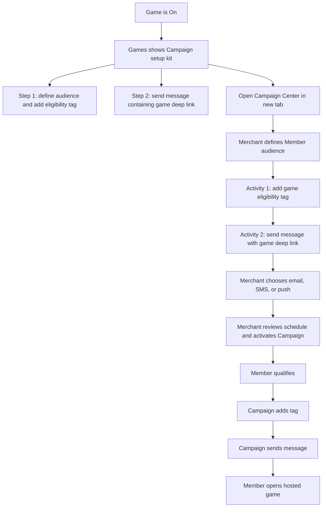

Campaign activities must be sequenced so the eligibility tag is applied before the message is sent.

The UI must explain that the tag makes the game visible only to the selected Members. Example audience copy: Members who spent over $100 in the last 3 months.

Games does not create or edit the merchant's audience, message, channel, or Campaign schedule in MVP. It provides guided instructions, the stable eligibility tag, and the reusable deep link.

## Member Access Decision Flow

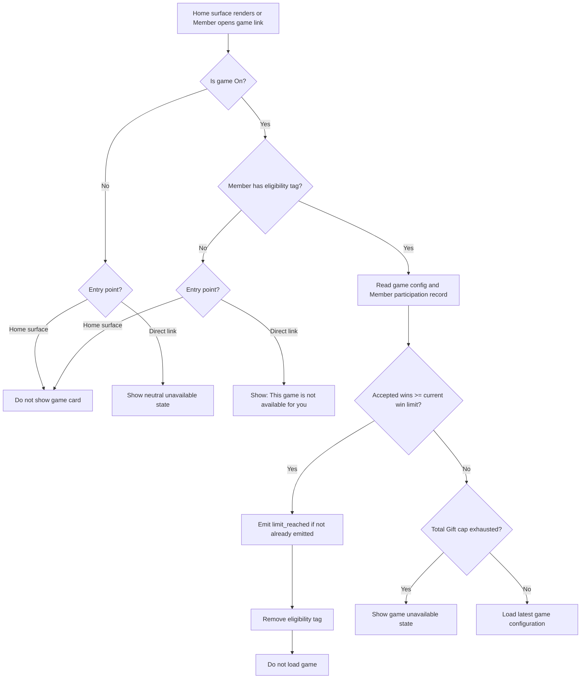

### Access rules

- Game status is checked centrally on every load. Pausing a game blocks access immediately even if tags remain.
- The eligibility tag is required for the first and every subsequent game load.
- The participation counter is shared across all Campaigns that distribute the same game.
- A direct link never grants eligibility by itself.
- After final-win tag removal, future visits show an unavailable state. The out-of-wins state is shown only in the final-win session.

## Accepted Win and Gift Flow

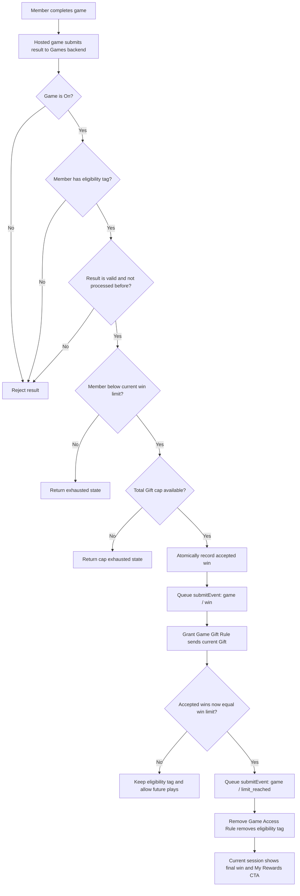

The Games backend, not Campaign Center, decides whether a win is accepted. Campaign Center performs the Gift and tag actions only after receiving an accepted event.

## Suggested submitEvent Mapping

The exact generic-field contract must be locked with R&D before implementation.

### Accepted win event

```json
{
  "event": {
    "type": "game",
    "subType": "win",
    "time": "<accepted-at>",
    "data": {
      "StringValue1": "<game-id>",
      "StringValue2": "<accepted-win-id>",
      "NumericValue1": "<member-accepted-win-count>",
      "NumericValue2": "<current-wins-allowed>",
      "BooleanValue1": "<is-final-allowed-win>"
    },
    "tags": ["ai-games"]
  }
}
```

### Limit reached event

```json
{
  "event": {
    "type": "game",
    "subType": "limit_reached",
    "time": "<detected-at>",
    "data": {
      "StringValue1": "<game-id>",
      "StringValue2": "<limit-event-id>",
      "NumericValue1": "<member-accepted-win-count>",
      "NumericValue2": "<current-wins-allowed>"
    },
    "tags": ["ai-games"]
  }
}
```

## Managed Rule Flow

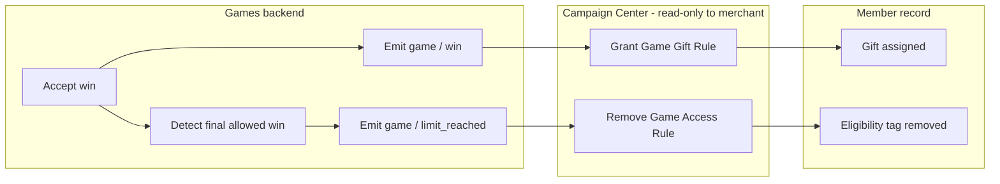

### Rule ownership

- Rules are visible in Campaign Center with a `Managed by Games` label.
- Merchants can inspect them but cannot edit their trigger or action directly.
- Gift changes in Games synchronize the Gift action used for future accepted wins.
- The eligibility tag is added by merchant-controlled Campaign activities, not by a Games-managed Rule.

## Configuration Edit Flow While On

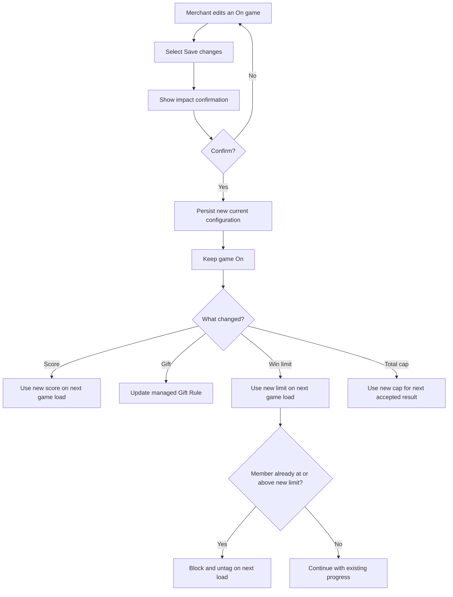

Editing never resets Member progress. If a clean participation cycle is required later, it should be a separate product decision rather than a side effect of saving or reactivation.

## Pause and Resume Flow

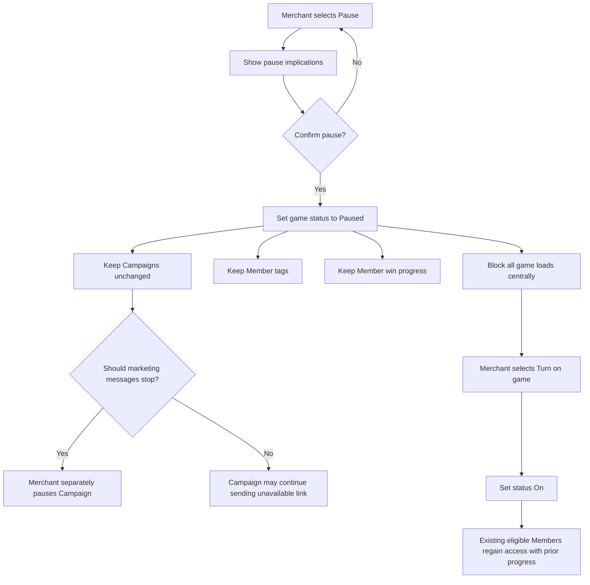

The pause confirmation must explicitly warn that pausing a game does not pause Campaigns.

## Multiple Campaigns Using One Game

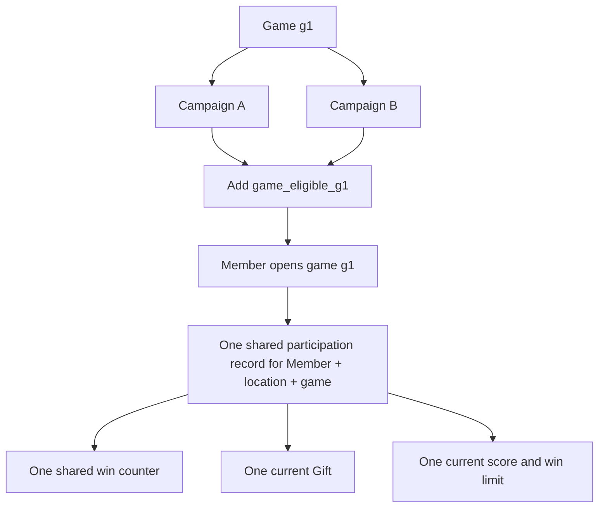

Two Campaigns do not create two participation cycles. Reapplying the same tag is harmless, and the Member continues against the same game-level counter.

## Scenario Matrix

| Scenario | Expected behavior |
|---|---|
| Game is Draft | Merchant can edit and test; Members cannot access it |
| Game is Ready | Configuration is saved; hosted game is not available |
| Game is On but no Campaign distributes it | Technical setup is active; no new Members see it |
| Member has tag and game is On | Latest configuration loads if Member is below limits |
| Member has no tag | Card is hidden; direct link shows unavailable state |
| Game is Paused and Member has tag | Card is hidden and direct access is blocked centrally |
| Marketing Campaign ends | Existing tagged Members keep access until exhausted or game is paused |
| Gift changes while On | Future accepted wins receive the new Gift; delivered Gifts do not change |
| Win limit is lowered | Affected Members are reconciled on their next game load |
| Member reaches final allowed win | Gift is assigned, access tag is removed, final session shows My Rewards CTA |
| Member returns after final win | Game is hidden; direct link shows unavailable state |
| Two Campaigns target same Member for same game | Both point to one shared participation record and counter |

## Concurrency and Reliability Requirements

The backend must handle these operations atomically or idempotently:

1. Validate the submitted result.
2. Confirm game status and Member eligibility.
3. Confirm the result ID was not accepted previously.
4. Confirm the Member and global Gift limits are not exhausted.
5. Increment the accepted-win counter.
6. Reserve one unit from the total Gift cap.
7. Persist an outgoing event record.
8. Retry `submitEvent` without granting duplicate Gifts.

Recommended backend shape:

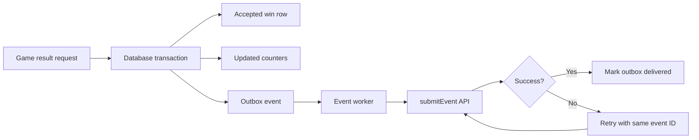

## Developer Decisions Still Required

1. Confirm the production name, key, and ownership of the Member participation table.
2. Define the unique result ID and database constraint used to reject duplicate game submissions.
3. Confirm how Campaign Center prevents duplicate Gift delivery when `submitEvent` is retried.
4. Confirm the exact generic-field mapping for `game / win` and `game / limit_reached`.
5. Define transaction or locking behavior for the final remaining unit of the total Gift cap.
6. Confirm how quickly eligibility-tag changes propagate to Customer Portal and mobile surfaces.
7. Confirm that Campaign activities guarantee tag-before-message sequencing.
8. Decide whether a future explicit `Reset Member progress` action is needed. It is not part of MVP.

## UI Mapping In The Prototype

The Generate+Games screen now represents this model:

1. `Save configuration` saves a Draft as Ready and explains the impact of edits.
2. `Turn on game` activates the hosted game and the two managed Rules.
3. `Use in Campaign` shows the stable eligibility tag, reusable deep link, and ordered Campaign instructions.
4. `Pause` blocks the game centrally while preserving tags and Member progress.
5. Member targeting no longer appears in the game configuration card.
